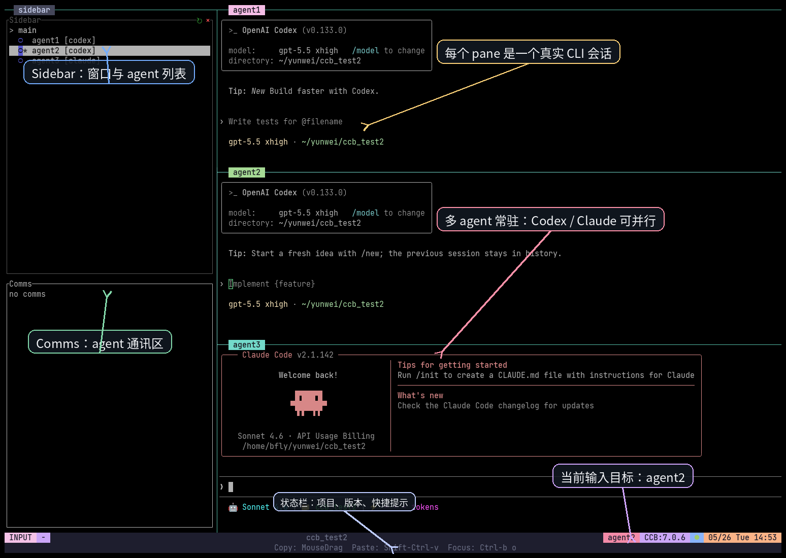

# v7 Interface And Basic Functions

Date: 2026-05-26

Role: Topic
Status: Active planning
Read when: Writing the README section that explains the v7 workspace UI and basic functions
Related: [readme-implementation-blueprint.md](readme-implementation-blueprint.md), [media-capture-and-asset-plan.md](media-capture-and-asset-plan.md), [tmux-onboarding-runbook.md](tmux-onboarding-runbook.md)

## Purpose

The README needs a user-facing v7 interface introduction, not only a screenshot.
This section should answer:

- what the user is looking at after running CCB;
- what each visible area is responsible for;
- which basic actions are available from the workspace;
- how the v7 sidebar and named panes reduce confusion for new users.

## Placement

Place this after the hero screenshot and before deeper daily-operation/config
sections:

1. `CCB v7 界面速览`
2. annotated `ccb_test2` screenshot
3. region/function table
4. folded detail for sidebar state and Comms meaning

This section should stay visible by default because it is the bridge between
"multi-agent concept" and "how do I operate this screen".

## Screenshot Source

Use the regenerated real terminal screenshots for public README references:

- `assets/readme_v7/ccb-test2-terminal-annotated.png` for Chinese README.
- `assets/readme_v7/ccb-test2-terminal-annotated-en.png` for English README.
- `assets/readme_v7/ccb-test2-terminal.png` as the unannotated real terminal
  capture.

The older text-rendered full-workspace image remains a planning reference only:
`ccb-test2-workspace-annotated.png`. Sidebar/Codex/Claude local detail crops
were removed after maintainer review to keep the README focused on the main
interface screenshot and explanation table.

Current `ccb_test2` visible areas:

- left sidebar pane: window and agent list plus Comms area;
- right top pane: `agent1` Codex;
- right middle pane: active `agent2` Codex;
- right bottom pane: `agent3` Claude;
- active marker: the pane receiving keyboard input.

## Visible README Copy Draft

```md
## CCB v7 界面速览

CCB v7 的核心变化是把多个 agent 的运行状态放到一个可见的项目工作台里。你不需要猜某个 agent 在哪里、是否还活着、当前输入会发给谁，界面会把这些信息放在同一个 tmux workspace 中。
```

Then show the regenerated real terminal screenshot:

```md

```

Visible region/function table:

| 区域 | 基本功能 | 新用户需要知道什么 |
| :--- | :--- | :--- |
| Sidebar / 窗口列表 | 显示当前 CCB project 的 window 和 agent 列表。 | 先看这里确认有哪些 agent 已经挂载，以及当前在哪个 window。 |
| Agent 行 | 显示 agent 名称、provider 和活动状态。 | `agent1 [codex]`、`agent3 [claude]` 这类信息告诉你每个 pane 后面是哪家 CLI。 |
| Active 标记 | 标出当前选中的 pane 或 agent。 | 键盘输入只会进入 active pane；如果输入位置不对，先点击目标 pane。 |
| Comms | 显示 agent-to-agent ask/job 通讯状态。 | 发起 `/ask` 或 `$ask` 后，可以在这里观察任务是否发送、执行、返回或失败。 |
| Agent pane | 每个 pane 是一个真实 CLI agent 会话。 | 可以把它当作一个命名队友：它有自己的上下文、provider 状态和工作区策略。 |
| Window | v7 可以把 agents 按 `main`、`work`、`review` 等 window 分组。 | 项目复杂后，不必把所有 agent 挤在一个屏幕里。 |
| Pane 标题/边框 | 显示 pane 名称、provider 或 active 状态。 | 边框/标题用于确认你正在操作哪个 agent。 |

## Basic Functions To Explain

The section should briefly explain these functions in plain language:

| Function | User-Facing Explanation |
| :--- | :--- |
| Visible multi-agent workspace | Multiple CLI agents stay visible in one project-owned tmux workspace instead of separate hidden terminals. |
| Named agents | Agents are referenced by stable names such as `main`, `worker1`, `reviewer`, or `agent2`. |
| Mixed providers | Different panes can run different providers, for example Codex and Claude in the same project. |
| Active input target | Only one pane receives keyboard input at a time; click or switch focus before typing. |
| Ask communication | `/ask` and `$ask` route work to a named agent; Comms shows the communication state. |
| Windows grouping | v7 `[windows]` can group agents by workflow area such as planning, implementation, review, or research. |
| Sidebar visibility | The sidebar is the project map: it shows window/agent structure and communication status. |
| Worktree isolation | Agents configured with `(worktree)` can work in isolated git worktrees. Explain here only at a high level and link to config section. |
| Project-scoped runtime | The workspace belongs to the current project, so startup, attach, recovery, and cleanup are project-scoped. |

## Folded Detail: Sidebar State

Fold this under `<details>` so the first-read path stays light:

```md
<details>
<summary><b>Sidebar 状态怎么看？</b></summary>

- window 行表示一个 tmux window，例如 `main`、`work`、`review`。
- agent 行表示一个可交互的 CLI agent，例如 `main [codex]` 或 `reviewer [claude]`。
- active 标记表示当前键盘输入目标。
- Comms 区显示 ask/job 的近期通讯状态。
- 如果 sidebar 看起来暂时没有更新，先观察 agent pane；sidebar 是状态视图，不是第二套配置来源。

</details>
```

## Sidebar Credit

The README should explicitly acknowledge the upstream project that inspired and
enabled the sidebar work:

```md
> Sidebar 相关实现基于/借鉴了 [tmux-agent-sidebar](https://github.com/hiroppy/tmux-agent-sidebar) 的思路，在此表示感谢。
```

Recommended placement:

- brief credit immediately after the `CCB v7 界面速览` sidebar explanation;
- a second mention in the final `致谢 / Credits` section if the README has one.

Keep the visible credit short. Do not move implementation details such as fork
scope, Rust helper internals, or CCB-specific ProjectView behavior into the
README; those remain in the sidebar integration plan.

## Folded Detail: What Is Not Shown

Avoid overclaiming:

- Manual user-created panes are not part of CCB config authority.
- Runtime internals under `.ccb/ccbd` are not normal user controls.
- Provider-native hidden subagents inside a provider may not appear as CCB
  named panes unless they are configured as CCB agents.

## Copy Rules

- Use Chinese terms first in `README_zh.md`, with concise English keywords where
  they match the UI, such as `Sidebar`, `Comms`, `pane`, and `window`.
- Avoid backend contract words such as authority, lifecycle records, namespace,
  or topology in the visible section.
- Keep one screenshot and one table visible. Move state details, caveats, and
  provider-specific behavior into `<details>`.
- Explain what users can do, not how the daemon implements it.

## Acceptance Criteria

- A new user can identify sidebar, Comms, active pane, agent panes, and windows
  from the screenshot.
- The section explains what each area does and what action the user should take.
- Basic functions include visible agents, named agents, mixed providers, active
  input, ask communication, windows grouping, and high-level worktree isolation.
- The section links naturally into tmux keyboard operations and config design.
